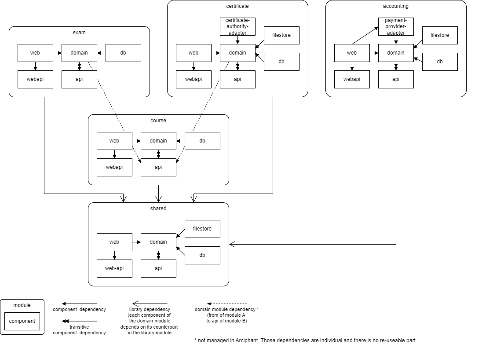

# Demo Project

The sub-project `arciphant-demo-project` demonstrates an application that uses arciphant.

**DISCLAIMER: The application is neither complete nor useful in any way. No emphasis was placed on clean code or meaningful patterns.
It's just some code in the language of a (potential) domain that has some dependencies between components to showcase the possibilities of arciphant.**

The arciphant configuration in specified in the demo project ([settings.gradle.kts](./arciphant-demo-project/settings.gradle.kts)) defines the following module structure for an online learning platform:

