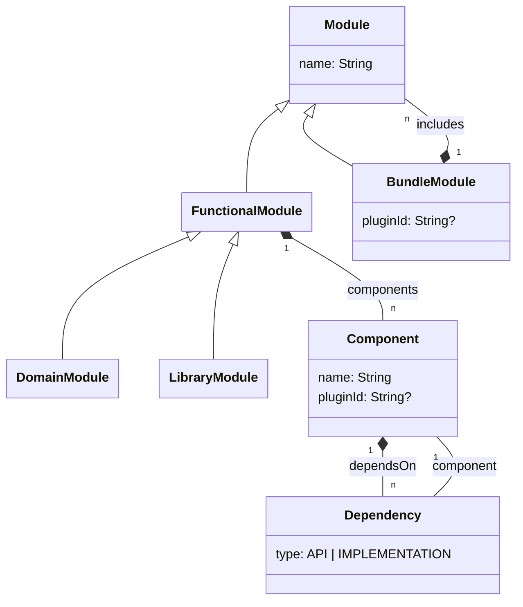

Arciphant describes a build as a set of **modules** that are made up of **components**, both declared via **templates**.
This page defines these terms as they are used throughout the documentation.
See [Declare Structure](/declare-structure) for how to work with them in the DSL.

## Module

A module is a vertical slice of your application — typically a domain or bounded context such as `accounting` or
`certificate`. Arciphant knows three kinds of modules:

- A **domain module** (declared with `module(...)`) contains the business functionality of one domain.
- A **library module** (declared with `library(...)`) contains shared code that all domain modules may use. Each
  component of each domain module automatically gets an `api` dependency on the same-named component of the library
  module — see [Shared code](/declare-structure#shared-code).
- A **bundle module** (declared with `bundle(...)`) assembles <Tooltip headline="Functional module" tip="Domain and library modules — modules that consist of components.">functional modules</Tooltip> into a deployable application. It
  depends on the modules it includes and has no components of its own — see
  [Bundle modules](/declare-structure#bundle-modules).

Domain and library modules are collectively called **functional modules**: modules that consist of components.

## Component

A component is a technical building block inside a functional module — one layer or ring of your architecture style,
such as `domain`, `application`, `web` or `db`. Components declare dependencies on other components of the same module,
either as `implementation` or as `api` dependencies — see
[Dependency types](/declare-structure#dependency-types).

How a component is realized in Gradle depends on the [component layout](/component-layouts): as a separate Gradle
project (project layout, the default) or as source sets inside the module's Gradle project (source set layout).

:::tip[The compiler enforces the architecture]
Either way, a component is a separate build unit with its own compile classpath — not just a package convention. The
compiler therefore enforces the declared architecture: code that accesses a component it does not depend on does not
compile, and an external framework is only visible to the components that declare it (the web framework in `web`, the
database library in `db` — the `domain` component stays framework-free).
:::

## Template

A template defines a reusable technical structure — a set of components and their dependencies — that modules are
instantiated from. Templates can [extend other templates](/declare-structure#different-shapes), modules can combine
[multiple templates](/declare-structure#multiple-templates) and additionally
[create](/declare-structure#individual-shapes) or [extend](/declare-structure#extending-components) individual
components. Templates are what keeps the module structure consistent across the code base and makes introducing a new
module a one-liner.

## Metamodel

The following diagram shows how these concepts relate:

:::note[Templates are not part of the metamodel]
Templates do not appear in the metamodel: they are a DSL-level mechanism to construct functional modules — once the
configuration is loaded, only the resulting modules and components remain.
:::
