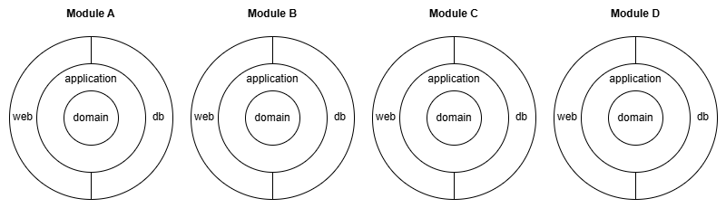
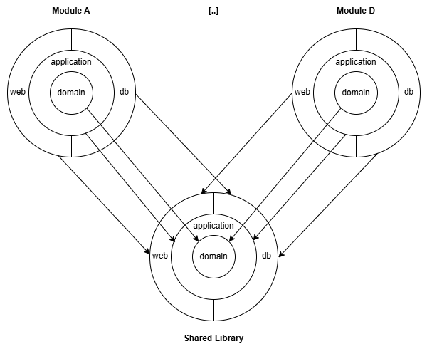
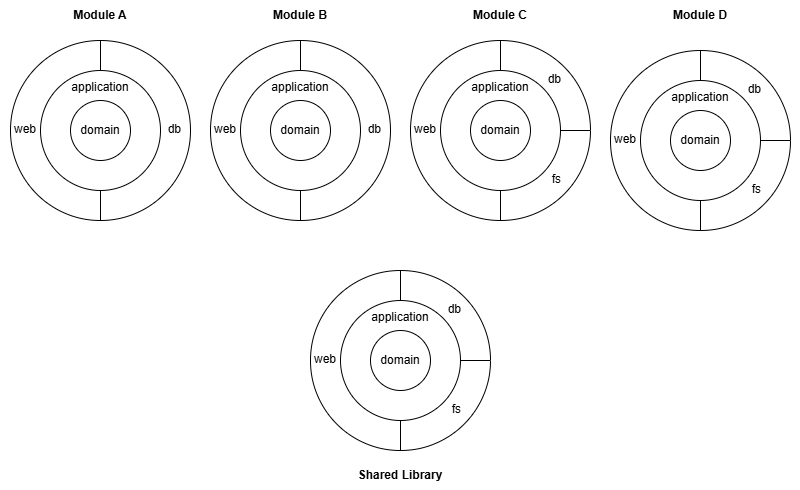
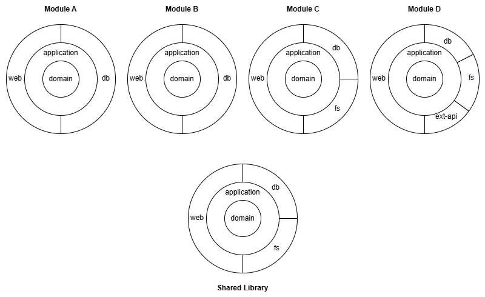

## A simple example

Assume you have a modulithic application with 4 domain modules. In each module, you want to have a
clean-architecture-like structure with the domain in the middle:



Building this structure with plain nested Gradle projects means a lot of duplicated build setup. With Arciphant you can
configure a template that defines the structure of the components (rings) of a module and then use this template to
create (instantiate) the 4 modules:

```kotlin settings.gradle.kts
arciphant {
    val moduleTemplate = template()
        .createComponent(name = "domain")
        .createComponent(name = "application", apiDependencies = setOf("domain"))
        .createComponent(name = "web", dependencies = setOf("application"))
        .createComponent(name = "db", dependencies = setOf("application"))

    module(name = "module-a", template = moduleTemplate)
    module(name = "module-b", template = moduleTemplate)
    module(name = "module-c", template = moduleTemplate)
    module(name = "module-d", template = moduleTemplate)
}
```

Above configuration creates the following nested Gradle project structure and sets up the dependencies between the
components (domain, application, web, db) in each module:

```text
root-project
|-- module-a
  |-- domain
  |-- application
  |-- web
  |-- db
|-- module-b
  |-- domain
  |-- application
  |-- web
  |-- db
|-- module-c
  |-- domain
  |-- application
  |-- web
  |-- db
|-- module-d
  |-- domain
  |-- application
  |-- web
  |-- db
```

## Dependency types

You probably noticed the two attributes for setting up dependencies between components:

- `dependencies`: Creates an _implementation_ dependency from component _A_ to component _B_
- `apiDependencies`: Creates an _api_ (transitive) dependency from component _A_ to component _B_, meaning that every
  component depending on _A_ gets access to _B_

In the above example this means that _web_ and _db_ can access _domain_ thanks to the API dependency of _application_.

:::info[Transitive dependencies in Clean Architecture]
Whether transitive dependencies (i.e. `apiDependencies`) are reasonable in a clean architecture or whether each ring (component) should only access the next inner ring is an interesting discussion.

Since Arciphant is a tool and not a methodology, it provides the ability without making a statement whether to use it or not.
:::

## Shared code

Now assume that for each of the components (rings) you need some shared code (e.g. some shared utility for all
db-components). So what you can do is create a shared library module with the same component structure. The following
image shows this setup (with only two modules for simplicity):



Normally you would have to manage all these dependencies manually, which is error-prone and pollutes the Gradle build
setup with repetitive code.

Arciphant instead provides an out-of-the-box mechanism: you can specify a library module:

```kotlin
library(name = "shared", template = moduleTemplate)
```

Each component of each domain module automatically gets an `api` dependency on the same-named component in the library
module.

The complete sample now looks like the following:

```kotlin settings.gradle.kts {8}
arciphant {
    val moduleTemplate = template()
        .createComponent(name = "domain")
        .createComponent(name = "application", apiDependencies = setOf("domain"))
        .createComponent(name = "web", dependencies = setOf("application"))
        .createComponent(name = "db", dependencies = setOf("application"))

    library(name = "shared", template = moduleTemplate)

    module(name = "module-a", template = moduleTemplate)
    module(name = "module-b", template = moduleTemplate)
    module(name = "module-c", template = moduleTemplate)
    module(name = "module-d", template = moduleTemplate)
}
```

:::info[Disclaimer regarding Library modules]
Whether a shared library is reasonable for independent domain modules may vary from case to case.
It is probably more accepted in case of a modulith than with microservices.

Since Arciphant is a tool and not a methodology, it provides the ability without making a statement whether to use it or not.
:::

## Different shapes

Now assume that some modules (e.g. Module C and Module D) need access to a file store (e.g. MinIO). You want to put this
code into a separate component called `fs` like the following:



You can solve this problem by creating another template, extending from the existing template:

```kotlin
val moduleWithFsTemplate = template()
    .extends(moduleTemplate)
    .createComponent(name = "fs", dependencies = setOf("application"))
```

The complete example now looks like the following:

```kotlin settings.gradle.kts {8-10,12,16-17}
arciphant {
    val moduleTemplate = template()
        .createComponent(name = "domain")
        .createComponent(name = "application", apiDependencies = setOf("domain"))
        .createComponent(name = "web", dependencies = setOf("application"))
        .createComponent(name = "db", dependencies = setOf("application"))

    val moduleWithFsTemplate = template()
        .extends(moduleTemplate)
        .createComponent(name = "fs", dependencies = setOf("application"))

    library(name = "shared", template = moduleWithFsTemplate)

    module(name = "module-a", template = moduleTemplate)
    module(name = "module-b", template = moduleTemplate)
    module(name = "module-c", template = moduleWithFsTemplate)
    module(name = "module-d", template = moduleWithFsTemplate)
}
```

:::note
Even though not all modules require the additional `fs` component, the library can be constructed out of
`moduleWithFsTemplate`. For modules without `fs` component, this is ignored.
:::

## Individual shapes

Of course, it is also possible to declare individual components in particular modules. E.g. if Module D requires the
integration of an external API, you want to create a dedicated component 'ext-api' for the integration code:



To do so, you can create a component for the specific module:

```kotlin
module(name = "module-d", template = moduleWithFsTemplate)
    .createComponent(name = "ext-api", dependencies = setOf("application"))
```

The complete example now looks like the following:

```kotlin settings.gradle.kts {18}
arciphant {
    val moduleTemplate = template()
        .createComponent(name = "domain")
        .createComponent(name = "application", apiDependencies = setOf("domain"))
        .createComponent(name = "web", dependencies = setOf("application"))
        .createComponent(name = "db", dependencies = setOf("application"))

    val moduleWithFsTemplate = template()
        .extends(moduleTemplate)
        .createComponent(name = "fs", dependencies = setOf("application"))

    library(name = "shared", template = moduleWithFsTemplate)

    module(name = "module-a", template = moduleTemplate)
    module(name = "module-b", template = moduleTemplate)
    module(name = "module-c", template = moduleWithFsTemplate)
    module(name = "module-d", template = moduleWithFsTemplate)
        .createComponent(name = "ext-api", dependencies = setOf("application"))
}
```

## Extending components

A template defines which dependencies a component has by default. Sometimes a single module needs an _additional_
dependency between components it inherited from the template. Continuing the example above: in Module D, the `web`
component should also be able to use the new `ext-api` component. Declaring `createComponent(name = "web", ...)` again
would fail because the component already exists — use `extendComponent` instead:

```kotlin {3}
module(name = "module-d", template = moduleWithFsTemplate)
    .createComponent(name = "ext-api", dependencies = setOf("application"))
    .extendComponent(name = "web", dependencies = setOf("ext-api"))
```

`extendComponent` adds the given `dependencies` and/or `apiDependencies` to the already declared component. Everything
else (the registered plugin and the existing dependencies) remains untouched. It is also available on templates, so a
template that `extends` another template can add dependencies to the inherited components as well.

:::note
`createComponent` and `extendComponent` are strict: creating a component that already exists fails, and so does
extending a component that does not exist. Each component can be extended at most once per module or template.
:::

## Multiple templates

A module or library can also be created from _several_ templates at once. The components of all templates are combined:

```kotlin
val messagingTemplate = template()
    .createComponent(name = "events", dependencies = setOf("application"))

module(name = "module-e", templates = setOf(moduleTemplate, messagingTemplate))
```

Each component name may only be declared by one of the combined templates — combining templates that both declare a
component of the same name is a configuration error.

Templates are optional, by the way: a module can also be declared without any template and consist solely of individual
components:

```kotlin
module(name = "tooling")
    .createComponent(name = "cli")
```

## Bundle modules

Domain modules should typically remain as isolated as possible. However, to package an application we need some kind of
bundle module that brings together all the modules. In Arciphant, it is possible to define bundle modules:

```kotlin
bundle(name = "my-app")
```

This creates a module `my-app` that has a dependency to all components of all modules. The bundle module itself does not
have any components. A convention plugin (e.g. for packaging the application with Spring Boot) can be registered for a
bundle — see [Bundle plugins](/using-plugins#bundle-plugins).

It is also possible to declare explicit dependencies, e.g. if you need multiple different bundles that should _not_
automatically depend on all domain modules:

```kotlin
bundle(name = "bundleX", includes = setOf(coreModuleA, coreModuleB, specificModuleX))
bundle(name = "bundleY", includes = setOf(coreModuleA, coreModuleB, specificModuleY))
```

Bundles can also include other bundles. So the above example could also be specified as follows to reduce duplication:

```kotlin
val coreBundle = bundle(name = "core", includes = setOf(coreModuleA, coreModuleB))
bundle(name = "bundleX", includes = setOf(coreBundle, specificModuleX))
bundle(name = "bundleY", includes = setOf(coreBundle, specificModuleY))
```

## Structurize test code

`java-test-fixtures` is a nice little Gradle plugin to deal with reusable test setup code. It basically creates an
additional source set `testFixtures` in between `main` and `test`. While `test` code should remain isolated, the idea of
`testFixtures` is that this code can be reused in other Gradle projects.
See [official documentation](https://docs.gradle.org/current/userguide/java_testing.html#sec:java_test_fixtures) for
further information.

Arciphant plays nicely with `java-test-fixtures`: If `java-test-fixtures` is applied in the Gradle build, it
automatically creates the dependencies for the `testFixtures` source sets between components. So if e.g. the
_application_ component depends on _domain_, the `testFixtures` of `domain` will be usable in `testFixtures` and `test`
of `application`. Of course, if it is an api dependency, the transitivity is also taken into account.

This describes the default `PROJECT` layout. In the `SOURCE_SET` layout, Arciphant creates dedicated production,
test-fixtures, and test source sets itself; the `java-test-fixtures` plugin is not required.
See [Component Layouts](/component-layouts) for configuration details.

## Debug project dependencies

To verify whether the dependencies Arciphant wired are as expected, run the `projectDependencies` task — see
[Gradle tasks](/tasks#projectdependencies).
