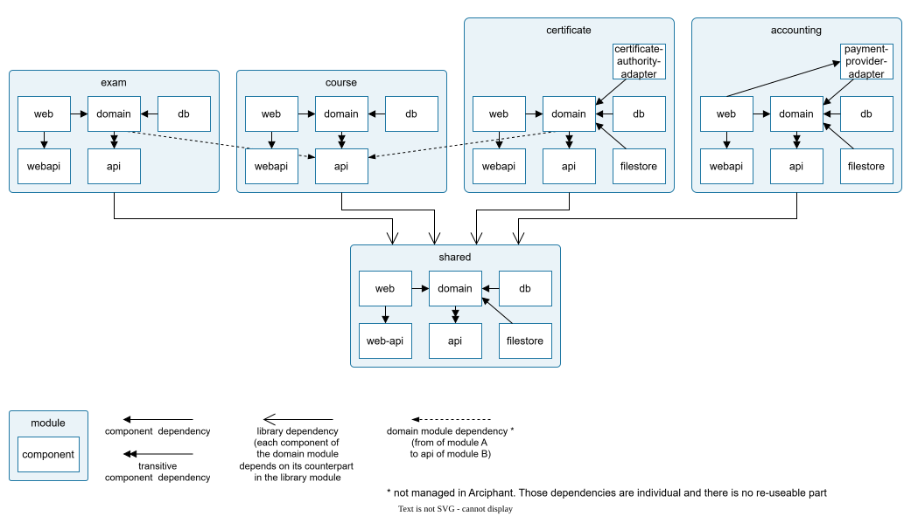

:::info
The demo application is neither complete nor useful in any way. No emphasis was placed on clean code or meaningful patterns.
It's just some sample code split into modules/components to showcase the usage of Arciphant.
:::

The <a href="https://github.com/ergon/arciphant" target="_blank" rel="noreferrer">Arciphant repository</a> contains two demo projects.
Both implement the same possible module structure for an online learning platform (course management, exams, certificates, accounting) - so you can
compare the two [component layouts](/component-layouts) side by side:

<Frame caption="Module structure of the Online Learning Platform demo application.">

</Frame>

| Demo project | Description |
|---|---|
| <a href="https://github.com/ergon/arciphant/blob/main/arciphant-project-demo/settings.gradle.kts" target="_blank" rel="noreferrer"><code style={{whiteSpace: 'nowrap'}}>arciphant-project-demo</code></a> | Uses the default **project layout**: every component is a separate Gradle project, configured through convention plugins registered per component type in the DSL. |
| <a href="https://github.com/ergon/arciphant/blob/main/arciphant-source-set-demo/settings.gradle.kts" target="_blank" rel="noreferrer"><code style={{whiteSpace: 'nowrap'}}>arciphant-source-set-demo</code></a> | Uses the **source set layout**: every module is a single Gradle project whose components are source sets. Each module applies a convention plugin in its `build.gradle.kts`, which configures the components via [shared dependency configurations](/component-layouts#shared-dependency-configurations). |

## Feature examples

Besides the two complete demo applications, the
<a href="https://github.com/ergon/arciphant/tree/main/examples" target="_blank" rel="noreferrer">`examples`</a> folder
contains small example builds, each focused on a single feature:

- <a href="https://github.com/ergon/arciphant/tree/main/examples/source-set-customization" target="_blank" rel="noreferrer">`source-set-customization`</a> —
  relocating the source directories of components in the source set layout with `customizeAllComponents` and
  `customizeComponent`. See [Customizing source directories](/component-layouts#customizing-source-directories).
