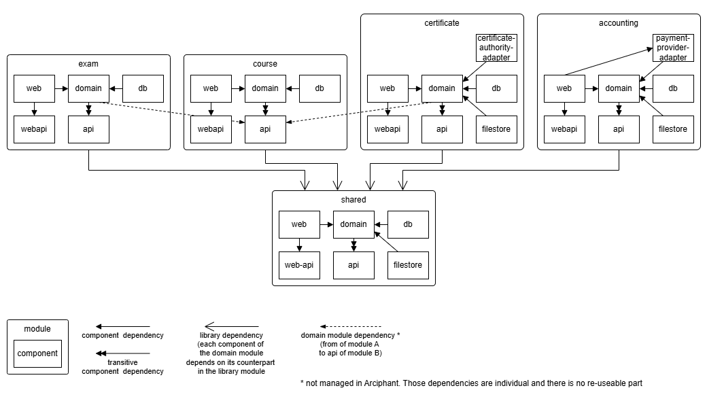

:::info[Disclaimer]
The demo application is neither complete nor useful in any way. No emphasis was placed on clean code or meaningful patterns.
It's just some sample code split into modules/components to showcase the possibilities of Arciphant.
:::

The <a href="https://github.com/ergon/arciphant" target="_blank" rel="noreferrer">Arciphant repository</a> contains two demo projects. Both
implement the same online learning platform with the following module structure, one for
each [component layout](/component-layouts):

## Project layout demo

The sub-project `arciphant-project-demo` uses the default project layout: every component is a separate Gradle project.
The arciphant configuration is specified in
its <a href="https://github.com/ergon/arciphant/blob/main/arciphant-project-demo/settings.gradle.kts" target="_blank" rel="noreferrer">settings.gradle.kts</a>.

## Source set layout demo

The sub-project `arciphant-source-set-demo` implements the same module structure with
the [source set component layout](/component-layouts): every functional module is a single Gradle project whose
components are source sets. The arciphant configuration is specified in
its <a href="https://github.com/ergon/arciphant/blob/main/arciphant-source-set-demo/settings.gradle.kts" target="_blank" rel="noreferrer">settings.gradle.kts</a>.
