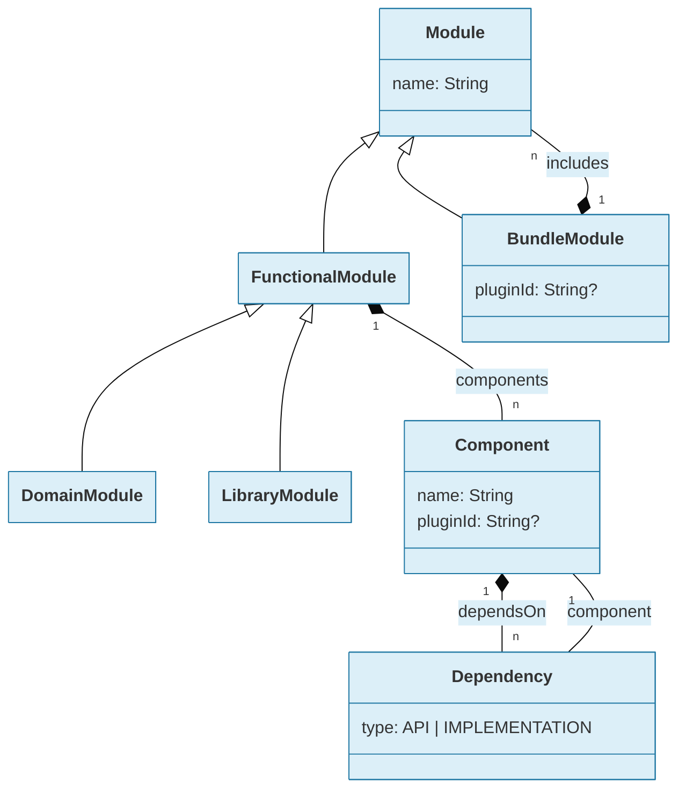

The following diagram shows the conceptual metamodel of Arciphant. See [Declare Structure](/declare-structure) for how
modules and components can be created.

```mermaid
---
config:
    theme: base
    class:
        hideEmptyMembersBox: true
    themeVariables:
        primaryColor: "#DCEFF8"
        primaryBorderColor: "#2078A4"
    themeCSS: ".edgeLabel, .edgeLabel span, .edgeLabel .labelBkg { background: transparent !important; }"
---
classDiagram
    class Module {
        name: String
    }

    class FunctionalModule

    class DomainModule
    class LibraryModule

    class BundleModule {
        pluginId: String?
    }

    class Component {
        name: String
        pluginId: String?
    }

    class Dependency {
        type: API | IMPLEMENTATION
    }

    FunctionalModule "1" *-- "n" Component : components

    Component "1" *-- "n" Dependency : dependsOn
    Dependency -- "1" Component: component

    Module <|-- FunctionalModule

    FunctionalModule <|-- LibraryModule
    FunctionalModule <|-- DomainModule

    BundleModule "1" *-- "n" Module: includes

    Module <|-- BundleModule
```
