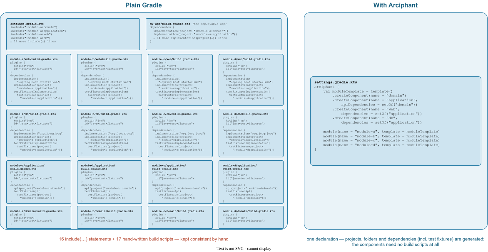

import icon from "../public/icon.svg";

<div style={{ display: "flex", justifyContent: "center" }}>
  
</div>

Arciphant is a Gradle **settings plugin** for projects built from many modules that share the same technical structure —
moduliths, Clean Architecture, Hexagonal Architecture and friends. Instead of maintaining dozens of `include(...)`
statements and near-identical `build.gradle.kts` files, you describe that structure **once**, as a template, directly in
`settings.gradle.kts`:

```kotlin settings.gradle.kts
arciphant {
    val moduleTemplate = template()
        .createComponent(name = "domain")
        .createComponent(name = "application", apiDependencies = setOf("domain"))
        .createComponent(name = "web", dependencies = setOf("application"))
        .createComponent(name = "db", dependencies = setOf("application"))

    module(name = "module-a", template = moduleTemplate)
    module(name = "module-b", template = moduleTemplate)
    module(name = "module-c", template = moduleTemplate)
    module(name = "module-d", template = moduleTemplate)
}
```

From this single declaration Arciphant generates the whole multi-project build: 16 Gradle projects, their folders on
disk, and every component dependency — test fixtures included. The component projects need **no `build.gradle.kts` at
all**, and adding a fifth module is one line.

<Expandable title="What this replaces in plain Gradle">

Mapping the same structure onto a plain Gradle build means 16 `include(...)` statements and 17 hand-written build
scripts — all repeating the same architecture rule, kept consistent by hand:

<Frame caption="The same structure, side by side: plain Gradle versus one `arciphant` declaration.">



</Frame>

The architecture rule ("_web_ depends on _application_, which exposes _domain_") is duplicated once per module. It has
to be kept consistent manually, test-fixture dependencies come on top, and every new module means copying the whole
boilerplate again.

### Beyond convention plugins

Convention plugins are Gradle's own answer to duplicated build logic — and Arciphant builds on them,
[registering them per component type](/using-plugins). But convention plugins deduplicate build **logic**, not build
**structure**: a plugin does not know _which_ projects exist or how they relate. Even with convention plugins in place,
every component still needs its `include(...)` statement and a build script wiring its project dependencies (test
fixtures included), and the architecture rule is still repeated — and kept consistent only by discipline — in every
module. Arciphant removes exactly this structural duplication.

</Expandable>

## Why Arciphant

<CardGroup cols={2}>
  <Card title="Templates instead of boilerplate" icon="component">
    Define your architecture style once as a template — every module instantiated from it gets the same shape.
    Introducing a new module is a one-liner.
  </Card>
  <Card title="Dependencies wired automatically" icon="cable">
    Component dependencies become `implementation` and `api` dependencies, shared libraries are exposed to every
    module, and test-fixture dependencies work out of the box.
  </Card>
  <Card title="The compiler enforces the architecture" icon="shield-check">
    Components are separate build units, so code that violates the declared dependencies does not even compile. And 
    framework/libary code is only on the classpath of the components that declare it.
  </Card>
  <Card title="Clean package structure" icon="package-check">
    The `validatePackageStructure` task checks that code lives in the packages your module structure prescribes — no
    extra tools like ArchUnit needed for the basics.
  </Card>
</CardGroup>

:::tip[Is Arciphant for you?]
Arciphant offers the greatest benefit when many modules share the same or a similar technical structure — for example
in a modulith with a Clean, Hexagonal, Onion or Layered Architecture. For a build with a handful of heterogeneous
projects, plain Gradle is just fine.
:::

## Start here

<CardGroup cols={2}>
  <Card title="Setup" href="/setup" icon="monitor-cog">
    Prerequisites, compatibility and how to apply the plugin.
  </Card>
  <Card title="Quickstart" href="/quickstart" icon="rocket">
    Create a first Arciphant project from scratch in five minutes.
  </Card>
  <Card title="Concepts" href="/concepts" icon="layout-panel-top">
    Modules, components, templates and bundles — the building blocks.
  </Card>
  <Card title="Demo projects" href="/demo-project" icon="circle-play">
    A complete example application, once per component layout.
  </Card>
</CardGroup>

## About the project

Arciphant is written in Kotlin, developed by <a href="https://www.ergon.ch" target="_blank" rel="noreferrer">Ergon
Informatik AG</a> and released under the <a href="https://github.com/ergon/arciphant/blob/main/LICENSE" target="_blank"
rel="noreferrer">MIT License</a>. The publisher does _not_ guarantee active maintenance and further development — we
work on the plugin to the extent that we need for our own projects.

The name combines **arc**hitecture and ele**phant** — the elephant being both a metaphor for a large project and a nod
to the Gradle logo.

<div style={{ display: "flex", gap: "0.5rem", flexWrap: "wrap" }}>
  
  
  
</div>

<GithubInfo />
