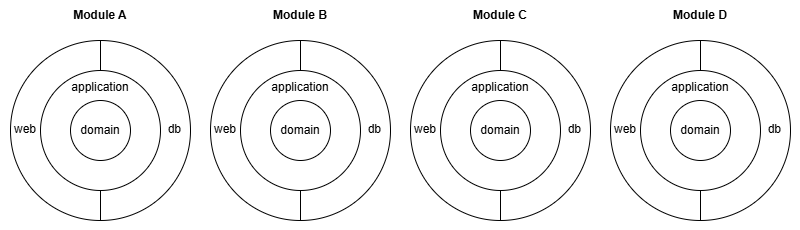
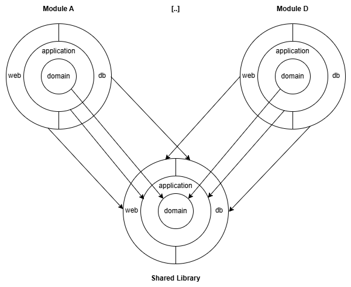
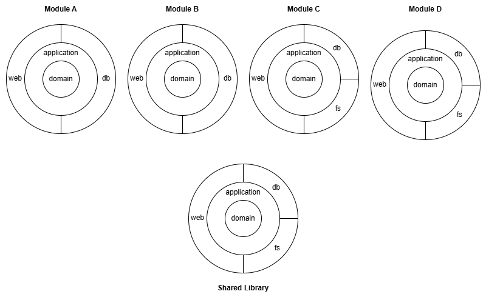
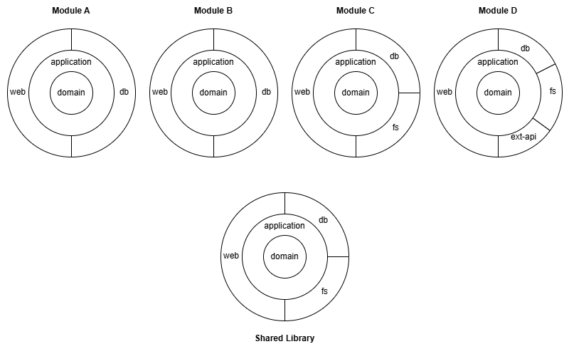

# Creating a component and module structure

## A simple example

Assume you have a modulithic application with 4 domain modules. In each module, you want to have a clean-architecture-like structure with the domain in the middle:



Normally, if you want to build this structure with nested gradle project, you have a lot of duplicated build-setup.
With arciphant you can configure a template that defines the structure of the components (rings) of a module and then use this template to create (instantiate) the 4 modules:

``` kotlin title="settings.gradle.kts"
arciphant {
    val moduleTemplate = template()
        .createComponent(name = "domain")
        .createComponent(name = "application", dependsOnApi = setOf("domain"))
        .createComponent(name = "web", dependsOn = setOf("application"))
        .createComponent(name = "db", dependsOn = setOf("application"))

    module(name = "module-a", template = moduleTemplate)
    module(name = "module-b", template = moduleTemplate)
    module(name = "module-c", template = moduleTemplate)
    module(name = "module-d", template = moduleTemplate)
}
```
Above configuration creates the following nested gradle project structure and sets up the dependencies between the components (domain, applicatoin, web, db) in each module:
```
root-project
|- module-a
 |- domain
 |- application
 |- web
 |- db
|- module-b
 |- domain
 |- application
 |- web
 |- db
|- module-c
 |- domain
 |- application
 |- web
 |- db
|- module-d
 |- domain
 |- application
 |- web
 |- db
```

## Dependency types

You probably noticed the different attributes to setup dependency between components:
* `dependsOn`: Creates a *implementation* dependency from component *A* to component *B*
* `dependsOnApi`: Creates an *api* (transitive) dependency from component *A* to component *B*, meaning that every component depending on *A* gets access to *B*

In above example this means that *web* and *db* can access *domain* thanks to the API dependency to *applicatoin*.

!!! info "Transitive dependencies in Clean Architecture"

    <p>Whether transitive dependencies (i.e. `dependsOnApi`) are reasonable in a clean architecture or whether each ring (component) should only access the next inner ring is an interesting discussion.</p>
    <p>Since Arcpihant is a tool and not a methodology, it provides the ability without making a statement whether to use it or not.</p>

## Shared code

Now assume that for each of the components (rings) you need some shared code (e.g. some shared utility for all db-components).
So what you can do is create a shared library module with the same component structure.
The following image shows this setup (with only two modules for simplicity):



What you normally have to do is manage all the dependencies manually, which is error prone and pollutes the gradle build setup with a lot of repetitive code.

Instead of having to manage all these dependencies manually, Arciphant provides an out-of-the-box mechanism. You can specify a library module:
``` kotlin title="settings.gradle.kts"
library(name = "shared", template = moduleTemplate)
```
Each component of each library module will automatically get e dependency to the respective component in the library module.

The complete sample now looks like the following:

``` kotlin title="settings.gradle.kts" hl_lines="8"
arciphant {
    val moduleTemplate = template()
        .createComponent(name = "domain")
        .createComponent(name = "application", dependsOnApi = setOf("domain"))
        .createComponent(name = "web", dependsOn = setOf("application"))
        .createComponent(name = "db", dependsOn = setOf("application"))

    library(name = "shared", template = moduleTemplate)

    module(name = "module-a", template = moduleTemplate)
    module(name = "module-b", template = moduleTemplate)
    module(name = "module-c", template = moduleTemplate)
    module(name = "module-d", template = moduleTemplate)
}
```

!!! info "Disclaimer regarding Library modules"

    <p>Whether a shared library is reasonable for independent domain modules may vary from case to case.
    It is probably more accepted in case of a modulith than with microservices.</p>
    <p>Since Arcpihant is a tool and not a methodology, it provides the ability without making a statement whether to use it or not.</p>

## Different shapes

Now assume that some modules (e.g. Module C and Module D) need access to a file store (e.g. MinIO). You want to put this code into a separate component called `fs` like the following:



You can solve this problem by creating another template, extending from the existing template:
``` kotlin title="settings.gradle.kts"
val moduleWithFsTemplate = template()
    .extends(moduleTemplate)
    .createComponent(name = "fs", dependsOn = setOf("application"))
```

The complete example now looks like the following:

``` kotlin title="settings.gradle.kts" hl_lines="8-10 16-17"
arciphant {
    val moduleTemplate = template()
        .createComponent(name = "domain")
        .createComponent(name = "application", dependsOnApi = setOf("domain"))
        .createComponent(name = "web", dependsOn = setOf("application"))
        .createComponent(name = "db", dependsOn = setOf("application"))

    val moduleWithFsTemplate = template()
        .extends(moduleTemplate)
        .createComponent(name = "fs", dependsOn = setOf("application"))

    library(name = "shared", template = moduleTemplate)

    module(name = "module-a", template = moduleTemplate)
    module(name = "module-b", template = moduleTemplate)
    module(name = "module-c", template = moduleWithFsTemplate)
    module(name = "module-d", template = moduleWithFsTemplate)
}
```

## Individual shapes

Of course, it is also possible to declare individual components in particular modules. E.g. if Module D requires the integration of an external API, you want to create a dedicated component 'api' for the integration code:



To do so, you can create a component for the specific module:
``` kotlin title="settings.gradle.kts"
module(name = "module-d", template = moduleWithFsTemplate)
    .createComponent(name = "ext-api", dependsOn = setOf("application"))
```

The complete example now looks like the following:

``` kotlin title="settings.gradle.kts"hl_lines="18"
arciphant {
    val moduleTemplate = template()
        .createComponent(name = "domain")
        .createComponent(name = "application", dependsOnApi = setOf("domain"))
        .createComponent(name = "web", dependsOn = setOf("application"))
        .createComponent(name = "db", dependsOn = setOf("application"))

    val moduleWithFsTemplate = template()
        .extends(moduleTemplate)
        .createComponent(name = "fs", dependsOn = setOf("application"))

    library(name = "shared", template = moduleTemplate)

    module(name = "module-a", template = moduleTemplate)
    module(name = "module-b", template = moduleTemplate)
    module(name = "module-c", template = moduleWithFsTemplate)
    module(name = "module-d", template = moduleWithFsTemplate)
        .createComponent(name = "ext-api", dependsOn = setOf("application"))
}
```

## Bundle modules

Domain modules should typically remain as isolated as possible.
However, to package an application we need some kind of bundle module that brings together all the modules.
In Arciphant, it is possible to define bundle modules:

``` kotlin title="settings.gradle.kts"
bundle(name = "my-app")
```

This creates a module `my-app` that has a dependency to all components of all modules. The bundle module itself does not have any components.

It is also possible to declare explicit dependencies, e.g. if you need mulitple different bundles who should *not* automatically depend to all domain modules:
``` kotlin title="settings.gradle.kts"
bundle(name = "bundleX", includes = setOf(coreModuleA, coreModuleB, specificModuleX))
bundle(name = "bundleY", includes = setOf(coreModuleA, coreModuleB, specificModuleY))
```

Bundles can also include other bundles. So above example could be configured as:
``` kotlin title="settings.gradle.kts"
val coreBundle = bundle(name = "core", includes = setOf(coreModuleA, coreModuleB))
bundle(name = "bundleX", includes = setOf(coreBundle, specificModuleX))
bundle(name = "bundleY", includes = setOf(coreBundle, specificModuleY))
```

## Structurize test code

`java-test-fixtures` is a nice little gradle plugin to deal with reusable test setup code.
It basically creates an additional source set `testFixtures` in between `main` and `test`.
While `test` code should remain isolated, the idea of `testFixtures` is that this code can be reused in other gradle projects.
See [official documentation](https://docs.gradle.org/current/userguide/java_testing.html#sec:java_test_fixtures) for further information.

Arciphant nicely plays together with `java-test-fixtures`: If `java-test-fixtures` is applied in the gradle build,
it automatically creates the dependencies for the `testFixtures` source sets between components.
So if e.g. the *application* component depends on *domain", the `testFixtures` of `domain` will be usable in `testFixtures` and `test` of `application`.
Of course, if is an api dependency, the transitivity is also taken into account.

## Debug project dependencies

If you have configured arciphant and you want to verify whether your project's dependencies are as expected, you can use the `projectDependencies` task from Arciphant.
It prints all the dependencies of each project in the whole project hierarchy. The task is only available in the root project.
