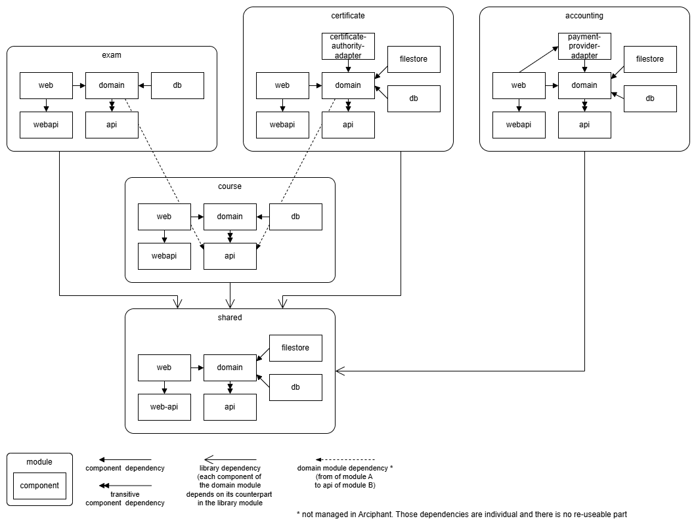

# Demo project

!!! info "Disclaimer"

    The demo application is neither complete nor useful in any way. No emphasis was placed on clean code or meaningful patterns.
    It's just some sample code split into modules/components to showcase the possibilities of arciphant.

The sub-project `arciphant-project-demo` in the [Arciphant repository](https://github.com/ergon/arciphant){ target="_blank" } demonstrates an application that uses arciphant.

The arciphant configuration specified in ([settings.gradle.kts](https://github.com/ergon/arciphant/blob/main/arciphant-project-demo/settings.gradle.kts){ target="_blank" }) defines the following module structure for an online learning platform:

The sibling sub-project `arciphant-source-set-demo` implements the same module structure with the [source set component layout](component-layouts.md): every functional module is a single Gradle project whose components are source sets.
