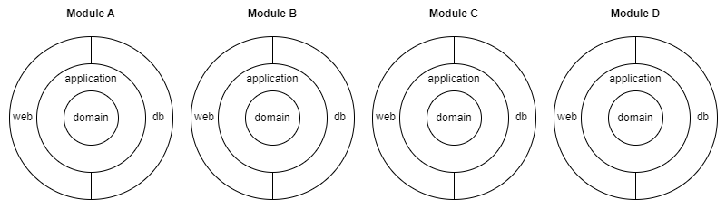
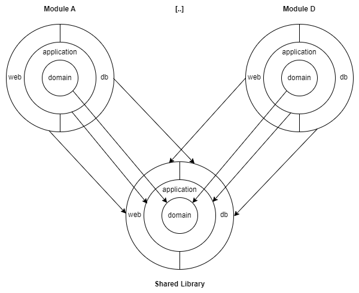
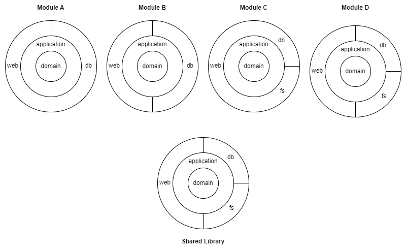
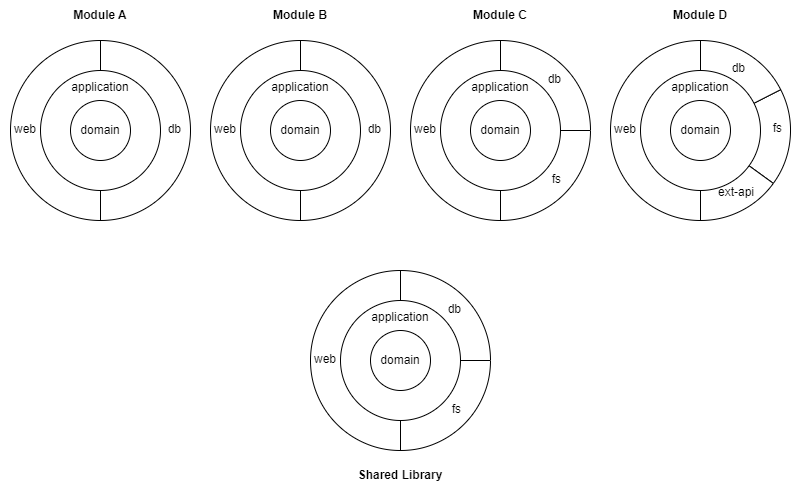

# Arciphant Documentation

## Prerequisites

### Java or Kotlin Plugin

In order to use Arciphant in your gradle build you have to apply either the *Java* or *Kotlin JVM* plugin to all projects in the project hierarchy 
(the reason is that Arciphant builds upon the configurations 'api' and 'implementation' registered by these plugins).

This is can typically be done in the the root project, e.g. like the following:
```
plugins {
  kotlin("jvm")
}

subprojects {
  plugins.apply("org.jetbrains.kotlin.jvm")
}
```

Of course you can also apply the *Java* or *Kotlin JVM* plugin inside a convention plugin and then apply this convention plugin to all projects.
It is also possible to register such a convention plugin in Arciphant. See chapter *Using Plugins*.


## Using Arciphant

Arciphant is a Gradle *settings* plugin. A settings plugin is different to normal plugins in that it is applied in the `settings.gradle.kts` file and *NOT* in `build.gradle.kts`. 

For the configuration of Arciphant, the plugin provides a simple DSL. The top-level element of the DSL is `arciphant {}`. So put the following to your `settings.gradle.kts`

```
plugins {
  id("ch.ergon.arciphant")
}

arciphant {
  // your arciphant config
}
```

## Defining a component structure for (domain) modules

### A simple example

Assume you have a modulithic application with 4 domain modules. In each module, you want to have a clean-architecture-like structure with the domain in the middle:



Normally, if you want to build this structure with nested gradle project, you have a lot of duplicated build-setup.
With arciphant you can configure a template that defines the structure of the components (rings) of a module and then use this template to create (instantiate) the 4 modules:

```
arciphant {
    val moduleTemplate = template()
        .createComponent(name = "domain")
        .createComponent(name = "application", dependsOnApi = setOf("domain"))
        .createComponent(name = "web", dependsOn = setOf("application"))
        .createComponent(name = "db", dependsOn = setOf("application"))

    module(name = "module-a", template = moduleTemplate)
    module(name = "module-b", template = moduleTemplate)
    module(name = "module-c", template = moduleTemplate)
    module(name = "module-d", template = moduleTemplate)
}
```
Above configuration creates the following nested gradle project structure and sets up the dependencies between the components (domain, applicatoin, web, db) in each module:
```
root-project
|- module-a
 |- domain
 |- application
 |- web
 |- db
|- module-b
 |- domain
 |- application
 |- web
 |- db
|- module-c
 |- domain
 |- application
 |- web
 |- db
|- module-d
 |- domain
 |- application
 |- web
 |- db
```

#### Dependency-Types

You probably noticed the different attributes to setup dependency between components:
* `dependsOn`: Creates a *implementation* dependency from component *A* to component *B* 
* `dependsOnApi`: Creates an *api* dependency from component *A* to component *B*, meaning that every component depending on *A* gets access to *B*

In above example this means that *web* and *db* can access *domain* thanks to the API dependency to *applicatoin*.

<small>Remark: Whether API dependencies are reasonable in a clean architecture or whether each ring (component) should only access the next inner ring is an interesting discussion.
Since Arcpihant is a tool and not a methodology, it provides the ability to do things without making a statement about when and how to use it.</small>

### Shared Code

Now assume that for each of the components (rings) you need some shared code (e.g. some shared utility for all db-components).
So what you can do is create a shared library module with the same component structure.
The following image shows this setup (with only two modules for simplicity):



What you normally have to do is manage all the dependencies manually, which is error prone and pollutes the gradle build setup with a lot of repetitive code.

Instead of having to manage all these dependencies manually, Arciphant provides an out-of-the-box mechanism. You can specify a library module:
```
library(name = "shared", template = moduleTemplate)
```
Each component of each library module will automatically get e dependency to the respective component in the library module.

The complete sample now looks like the following:

```
arciphant {
    val moduleTemplate = template()
        .createComponent(name = "domain")
        .createComponent(name = "application", dependsOnApi = setOf("domain"))
        .createComponent(name = "web", dependsOn = setOf("application"))
        .createComponent(name = "db", dependsOn = setOf("application"))

    library(name = "shared", template = moduleTemplate)

    module(name = "module-a", template = moduleTemplate)
    module(name = "module-b", template = moduleTemplate)
    module(name = "module-c", template = moduleTemplate)
    module(name = "module-d", template = moduleTemplate)
}
```

<small>Remark: Whether a shared library is reasonable for independent domain modules may vary from case to case. 
It is probably more accepted in case of a modulith than with microservices.</small>

### Different Shapes

Now assume that some modules (e.g. Module C and Module D) need access to a file store (e.g. MinIO). You want to put this code into a separate component called `fs` like the following:



You can solve this problem by creating another template, extending from the existing template:
```
val moduleWithFsTemplate = template()
    .extends(moduleTemplate)
    .createComponent(name = "fs", dependsOn = setOf("application"))
```

The complete example now looks like the following:

```
arciphant {
    val moduleTemplate = template()
        .createComponent(name = "domain")
        .createComponent(name = "application", dependsOnApi = setOf("domain"))
        .createComponent(name = "web", dependsOn = setOf("application"))
        .createComponent(name = "db", dependsOn = setOf("application"))

    val moduleWithFsTemplate = template()
        .extends(moduleTemplate)
        .createComponent(name = "fs", dependsOn = setOf("application"))

    library(name = "shared", template = moduleTemplate)

    module(name = "module-a", template = moduleTemplate)
    module(name = "module-b", template = moduleTemplate)
    module(name = "module-c", template = moduleWithFsTemplate)
    module(name = "module-d", template = moduleWithFsTemplate)
}
```

### Individual Shapes

Of course it is also possible to declare individual components in particular modules. E.g. if Module D requires the integration of an external API, you want to create a dedicated component 'api' for the integration code:



To do so, you can create a component for the specific module:
```
module(name = "module-d", template = moduleWithFsTemplate)
    .createComponent(name = "ext-api", dependsOn = setOf("application"))
```

The complete example now looks like the following:

```
arciphant {
    val moduleTemplate = template()
        .createComponent(name = "domain")
        .createComponent(name = "application", dependsOnApi = setOf("domain"))
        .createComponent(name = "web", dependsOn = setOf("application"))
        .createComponent(name = "db", dependsOn = setOf("application"))

    val moduleWithFsTemplate = template()
        .extends(moduleTemplate)
        .createComponent(name = "fs", dependsOn = setOf("application"))

    library(name = "shared", template = moduleTemplate)

    module(name = "module-a", template = moduleTemplate)
    module(name = "module-b", template = moduleTemplate)
    module(name = "module-c", template = moduleWithFsTemplate)
    module(name = "module-d", template = moduleWithFsTemplate)
        .createComponent(name = "ext-api", dependsOn = setOf("application"))
}
```

### Bundle modules

Domain modules should typically remain as isolated as possible. 
However, to package an application we need some kind of bundle module that brings together all the modules.
In Arciphant, it is possible to define bundle modules:

```
bundle(name = "my-app")
```

This creates a module `my-app` that has a dependency to all components of all modules. The bundle module itself does not have any components.

It is also possible to declare explicit dependencies, e.g. if you need mulitple different bundles who should *not* automatically depend to all domain modules:
```
bundle(name = "bundleX", includes = setOf(coreModuleA, coreModuleB, specificModuleX))
bundle(name = "bundleY", includes = setOf(coreModuleA, coreModuleB, specificModuleY))
```

Bundles can also include other bundles. So above example could be configured as:
```
val coreBundle = bundle(name = "core", includes = setOf(coreModuleA, coreModuleB))
bundle(name = "bundleX", includes = setOf(coreBundle, specificModuleX))
bundle(name = "bundleY", includes = setOf(coreBundle, specificModuleY))
```

## Structurize test code

`java-test-fixtures` is a nice little gradle plugin to deal with reusable test setup code. 
It basically creates an additional source set `testFixtures` in between `main` and `test`. 
While `test` code should remain isolated, the idea of `testFixtures` is that this code can be reused in other gradle projects.
See [official documentation](https://docs.gradle.org/current/userguide/java_testing.html#sec:java_test_fixtures) for further information.

Arciphant nicely plays together with `java-test-fixtures`: If `java-test-fixtures` is applied in the gradle build,
it automatically creates the dependencies for the `testFixtures` source sets between components.
So if e.g. the *application* component depends on *domain", the `testFixtures` of `domain` will be usable in `testFixtures` and `test` of `application`.
Of course, if is an api dependency, the transitivity is also taken into account.

## Using Plugins

The real power of Arciphant comes into play when you use it in combination with convention plugins that configure your component's characteristic and external dependencies.

Convention plugins are pre-compiled script plugins that contain build logic. 
See the [official Gradle documentation](https://docs.gradle.org/current/userguide/implementing_gradle_plugins_precompiled.html) for detailed information.
They can bei either located in the `buildSrc` folder or in a separate gradle project that is included with `includeBuild` in `pluginManagement`.

Assuming that each of the components in your modules has some specific gradle setup such as external dependencies and the configuration around them.
For example in the web component there might be the dependency to a web-framework and in the db-layer a library that manages database access.

So assume you have the following convention plugins in your `buildSrc` folder specifying the dependencies/configurations for the respective component types:
```
spring-web-component.gradle.kts
jooq-component.gradle.kts
```

You can register these plugins for the components in Arciphant and they will be applied:

```
template()
    .createComponent(name = "web", plugin = "spring-web-component")
    .createComponent(name = "db", plugin = "jooq-component")
```

#### Using `includeBuild` instead of `buildSrc` for convention plugins

It is good practice to use a dedicated project for convention plugins instead of using `buildSrc`-folder and include it with `includeBuild`:
```
pluginManagement {
  [..]
  includeBuild("./build-logic")
}
```

Unfortunately, these plugins won't work together with arciphant out-of-the-box. The problem is that for some reason 
the `pluginManagement` block is only treated by gradle when plugins are applied in the `plugins` block.
Since arciphant applies plugins programmatically (using `pluginManager.apply("plugin-id")`), the plugin will not be found.
To overcome this issue you can use the following simple hack: just add one of the convention plugins to the plugins block of your `settings.gradle.kts` file with `apply false`:
```
plugins {
  [..]
  id("my-plugin") apply false
}
```
This seems to trigger the required plugin resolution strategy and arciphant is able to apply all plugins from the included build 
(even if only one plugin is referenced in `settings.gradle.kts`).

## Complete demo project

You can find a complete [Demo Project](./demo-project.md) in `./arciphant-demo-project`
